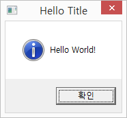
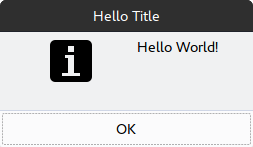
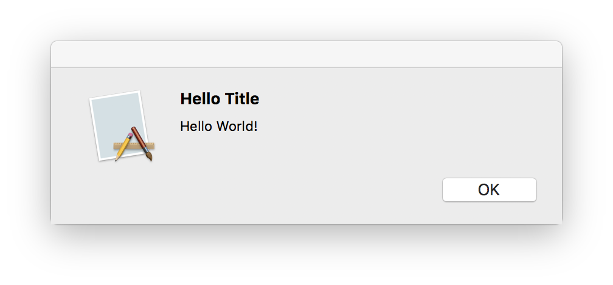

# msgbox-rs

| OS | Build Status |
| -- | ----- |
| Linux & OS X | [](https://travis-ci.com/bekker/msgbox-rs) |
| Windows | [](https://ci.appveyor.com/project/bekker/msgbox-rs) |


```rust
extern crate msgbox;

use msgbox::IconType;

fn main() {
    msgbox::create("Hello Title", "Hello World!", IconType::Info);
}
```







Simple, cross-platform message box GUI library.

All it does is to show a message box modal with an OK button, which runs synchronously.

It supports multi-platform, and maintains separate dependencies per platform, thus light-weight.

Example use case is to show a modal when an error occurs in OpenGL applications.

 - Synchronous Message Modal
 - Multi-platform (Linux GTK3+, Windows and OS X)
 - Light-weight

## Platform support
* Linux with GTK 3+ (Tested on Ubuntu Gnome 16.04)
* Windows (Tested on Windows 8.1 and 10)
* OS X (Tested on MacOS 10.13.3 High Sierra)

## Dev Requirements

### Linux
* `libgtk-3-dev` for apt
* `gtk3-devel` for yum

### Windows
* Windows version compatible with [winapi](https://github.com/retep998/winapi-rs)

### OS X
* Tested on High Sierra 10.13.3, but it should work on 10.3+

## License
Distributed under MIT License
